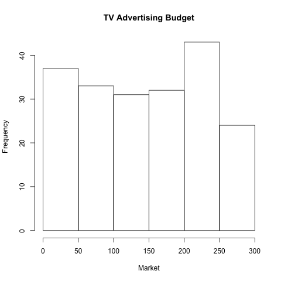
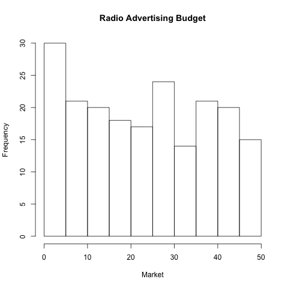
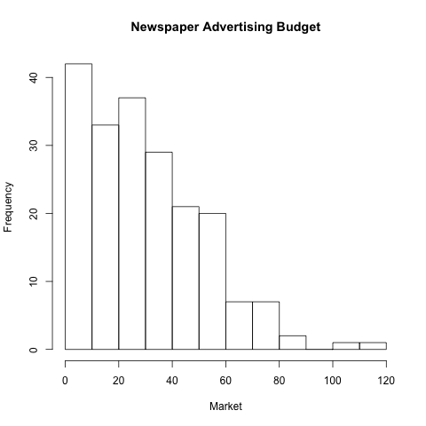
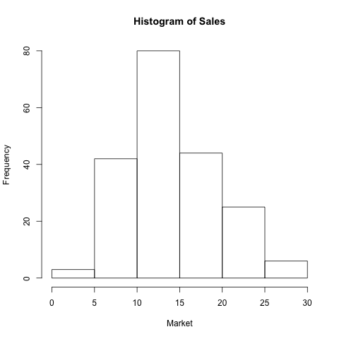

```{r echo=FALSE}
#Loading xtable package and setting up xtable and knitr formatting
library(xtable)
options(xtable.comment = FALSE)
options(knitr.comment = FALSE)

#Loading in RData files
load('../data/all_summary.RData')
load('../data/regression.RData')
load('../data/correlation_matrix.RData')
source('../code/functions/regression-functions.R')
```

#Abstract
This report replicates section 3.2 (Multiple Linear Regression) of the book *An Introduction to Statistical Learning*.

Concepts covered by this assignment include performing multiple regression analysis in R and using the package testthat.

#Introduction
This report analyzes the effects of different types of advertisement media on the overall sales of of a product. In the last assignment we only looked at the linear regression for Sales by TV, but now we will additionally perform a multiple regression analysis with all 3 advertising factors. 

#Data
Similarly to Homework 2, this assignment deals with the *Advertising.csv* dataset. It contains information about the advertising budgets for *TV*, *Radio*, and *Newspaper* advertisements as well as the resulting *Sales* in 200 markets.

Here are the summary statistics for the Advertising.csv dataset:

```{r,echo=FALSE,results='asis',message=FALSE}
xtable(all_summary,caption='Summary Statistics for Advertising.csv')
```

Additionally, here are the histograms of the distributions:

```{r,echo=FALSE,out.width='150px',message=FALSE,fig.align='center',eval=T,split=TRUE}

```
Histogram of TV Budgets

```{r,echo=FALSE,out.width='150px',message=FALSE,fig.align='center',eval=T,split=TRUE}

```
Histogram of Radio Budgets

```{r,echo=FALSE,out.width='150px',message=FALSE,fig.align='center',eval=T,split=TRUE}

```
Histogram of Newspaper Budgets

```{r,echo=FALSE,out.width='150px',message=FALSE,fig.align='center',eval=T,split=TRUE}

```
Histogram of Sales

#Methodology

_Single Linear Regression_
From Homework 2, looking at the effect of either *TV*, *Radio*, or *Newspaper* on *Sales* is a single linear regression in which expected Sales is predicted from a given advertising medium.

This follows the form:

$$Sales = \beta_{0} + \beta_{1}*(TV/Radio/Newspaper)$$

_Mutliple Linear Regression_
Now, we look at the combined effects of TV, Radio, and Newspaper marketing on Sales so we perform a multiple linear regression model which follows the form:

$$Sales = \beta_{0} + \beta_{1}*TV + \beta_{2}*Radio + \beta_{3}*Newspaper$$

#Results
_Regression of Sales by TV_
Performing a single regression analysis yields the following coefficients:

```{r,echo=FALSE,results='asis'}
tv_summary = summary(tv_fit)
xtable(tv_summary$coefficients, caption = 'Single Regression: Sales ~ TV')
```

These coefficients represent the slope and the intercept for the least squares regression line. Here are more parameters of the model:

```{r,echo=FALSE, results='asis',message=FALSE}
tv_table = matrix(nrow = 3, ncol = 2)
Quantity = c("RSE", "R2", "F-stat")
tv_values = c(residual_std_error(tv_fit), r_squared(tv_fit), f_statistic(tv_fit))
tv_table[,1] = Quantity
tv_table[,2] = tv_values
colnames(tv_table) = c('Quantity', 'Value')
xtable(tv_table, caption = "Regression Model Parameters: Sales ~ TV")
```

The $$R^2$$ and RSE values for this model are small, indicating that linear regression is an appropriate fit for the data.

_Regression of Sales by Radio_

```{r,echo=FALSE, results='asis',message=FALSE}
radio_table = matrix(nrow = 3, ncol = 2)
Quantity = c("RSE", "R2", "F-stat")
radio_values = c(residual_std_error(radio_fit), r_squared(radio_fit), f_statistic(radio_fit))
radio_table[,1] = Quantity
radio_table[,2] = radio_values
colnames(radio_table) = c('Quantity', 'Value')
xtable(radio_table, caption = "Quality Indices of Regression of Sales on Radio")
```


#Conclusion